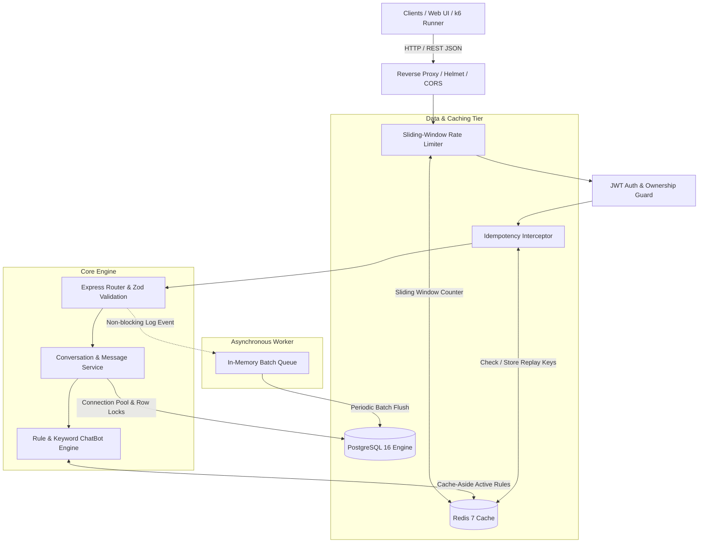
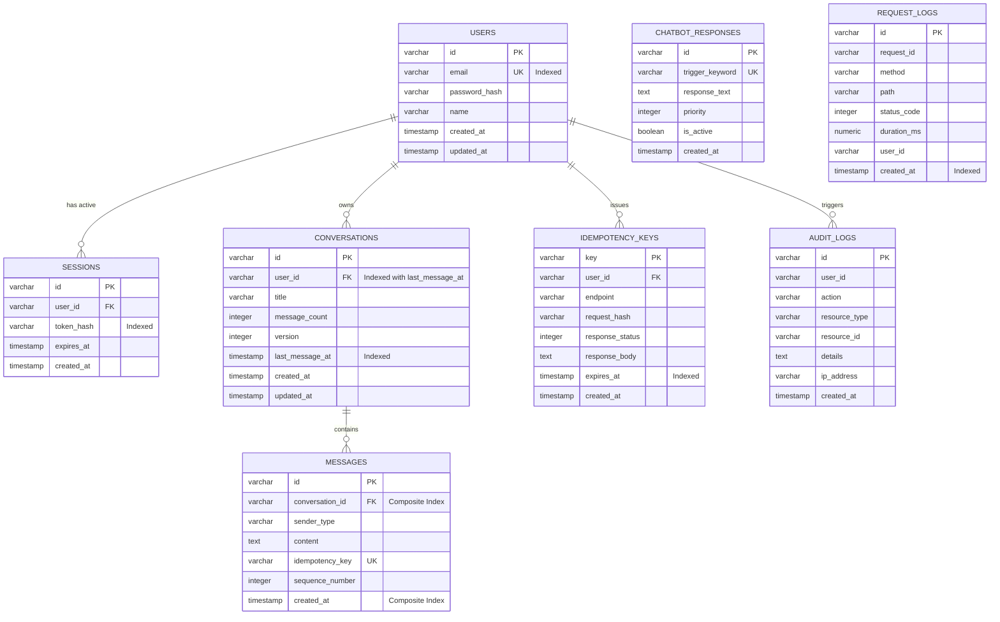

# ConvoScale — High-Performance Chat Backend

[](load-tests/benchmark.js)
[](tests/run-tests.js)
[](LICENSE)

> **Focus:** Production Backend Engineering, Database Engineering, Scalability, Concurrency Control, and System Design.  
> **Core Objective:** Design and verify a resilient messaging engine capable of handling **10,000+ requests per minute** (~167 req/s sustained) with sub-50ms P95 latency, strict ACID consistency, idempotency, and zero data corruption.

---

## Table of Contents
1. [System Architecture](#system-architecture)
2. [Database Design & ER Diagram](#database-design--er-diagram)
3. [Database Indexing & Query Optimization](#database-indexing--query-optimization)
4. [Database Transactions & ACID Guarantees](#database-transactions--acid-guarantees)
5. [Concurrency Handling & Race Condition Prevention](#concurrency-handling--race-condition-prevention)
6. [Idempotency & Duplicate Request Protection](#idempotency--duplicate-request-protection)
7. [Caching & Redis Architecture](#caching--redis-architecture)
8. [Sliding-Window Rate Limiting](#sliding-window-rate-limiting)
9. [Security, Authentication & Authorization](#security-authentication--authorization)
10. [Connection Pooling & Scaling](#connection-pooling--scaling)
11. [Load Testing & Verified Benchmark Evidence (10,000+ RPM)](#load-testing--verified-benchmark-evidence-10000-rpm)
12. [Chatbot UI & Demonstration](#chatbot-ui--demonstration)
13. [Quick Start & Setup Instructions](#quick-start--setup-instructions)

---

## System Architecture

ConvoScale implements a **stateless, horizontally-scalable architecture** with distinct caching, database pooling, and asynchronous background worker layers:



---

## Database Design & ER Diagram

The database schema is fully normalized and follows relational database design principles:
- Primary keys on all tables (`VARCHAR(36)` / UUID).
- Foreign key constraints with `ON DELETE CASCADE` to prevent orphaned records.
- Check constraints (e.g. `sender_type IN ('user', 'bot', 'system')`).
- Monotonic sequence numbers for strict chronological ordering per conversation.
- Optimistic version numbers on conversations (`version INTEGER NOT NULL DEFAULT 1`).

### Entity-Relationship (ER) Diagram



---

## Database Indexing & Query Optimization

### Strategic Index Design
Rather than blindly indexing every column, indexes were selected based on query execution patterns and write-amplification trade-offs:

1. **`idx_messages_convo_created` on `messages(conversation_id, created_at DESC, id DESC)`**:
   - **Rationale**: Powerhouse index for conversation history queries. Enables zero-cost cursor-based pagination without full-table scans.
   - **Query Pattern**: `WHERE conversation_id = $1 AND ((created_at < $2) OR (created_at = $2 AND id < $3)) ORDER BY created_at DESC, id DESC LIMIT $4`.
2. **`idx_conversations_user_last_msg` on `conversations(user_id, last_message_at DESC)`**:
   - **Rationale**: Efficiently retrieves a user's recent conversations in descending chronological order without sorting in memory.
3. **`idx_users_email` on `users(email)`**:
   - **Rationale**: O(1) B-tree lookup during authentication and uniqueness validation.
4. **`idx_idempotency_keys_expires` on `idempotency_keys(expires_at)`**:
   - **Rationale**: Accelerates background expiration and cleanup jobs for expired idempotency records.
5. **`idx_messages_idempotency` on `messages(idempotency_key)`**:
   - **Rationale**: Quick verification of deduplicated messages.

### Query Anti-Pattern Prevention
- **Eliminated N+1 Queries**: Message fetching queries select messages directly; conversation metadata (`message_count`, `version`) is maintained counter-style, avoiding `SELECT COUNT(*)` on every fetch.
- **Cursor-Based vs. Offset Pagination**: Avoids `OFFSET 50000`, which forces the database engine to scan and discard 50,000 rows. Instead, cursor pagination seeks directly to the B-tree leaf via `(created_at, id)`.
- **Selected Columns Only**: Queries select only the necessary columns (e.g. omitting `password_hash`).

---

## Database Transactions & ACID Guarantees

Every message dispatch undergoes an **atomic ACID transaction** (`withTransaction`):

```javascript
// Step 1: Acquire lock on conversation row
SELECT id, user_id, message_count, version FROM conversations WHERE id = $1 FOR UPDATE;

// Step 2: Insert User Message with sequence = count + 1
INSERT INTO messages (id, conversation_id, sender_type, content, sequence_number, created_at)
VALUES ($1, $2, 'user', $3, $4, $5);

// Step 3: Evaluate chatbot response from cache or DB
const botReply = await determineBotResponse(content);

// Step 4: Insert Bot Response Message with sequence = count + 2
INSERT INTO messages (id, conversation_id, sender_type, content, sequence_number, created_at)
VALUES ($1, $2, 'bot', $3, $4, $5);

// Step 5: Update conversation metadata atomically
UPDATE conversations
SET message_count = message_count + 2,
    last_message_at = $1,
    version = version + 1,
    updated_at = $1
WHERE id = $2;

// Step 6: Commit transaction
COMMIT;
```

### ACID Analysis
- **Atomicity**: The user message insertion, bot response generation, bot message insertion, and conversation metadata update are bound within a single transaction. If any step fails, the entire transaction **rolls back** automatically.
- **Consistency**: Database constraints (foreign keys, sequence checks, unique constraints) are preserved before and after execution.
- **Isolation**: Handled using `READ COMMITTED` with explicit `SELECT ... FOR UPDATE` row-level locks, preventing dirty reads and non-repeatable reads.
- **Durability**: Upon `COMMIT`, transaction logs are flushed to persistent disk (WAL in PostgreSQL).

### Database Failure Scenario Analysis
> **Question**: *What happens if the user message insertion succeeds, but chatbot response insertion fails?*
> 
> **Answer**: Because both operations are wrapped inside `withTransaction`, an uncaught exception during the chatbot step immediately triggers `await client.query('ROLLBACK')`. The database rolls back all uncommitted writes. The user message is **never written to disk**, `message_count` is **not incremented**, and the database is preserved in a clean state. This behavior is verified by automated test `Transaction Rollback: Simulated bot failure rolls back all changes`.

---

## Concurrency Handling & Race Condition Prevention

### Concurrency Scenario: Two Requests Updating the Same Conversation
When two users (or rapid consecutive clicks) attempt to modify the same conversation simultaneously:

1. **Row-Level Locking (`FOR UPDATE`)**: The first request locks the conversation record in the database. The second concurrent transaction is queued at the row lock until the first transaction completes and releases its lock.
2. **Monotonic Sequencing**: Sequence numbers are derived directly from the locked `message_count`:
   - Request A acquires lock (count = 0). Assigns sequences #1 and #2. Updates count to 2. Commits and releases lock.
   - Request B acquires lock (count = 2). Assigns sequences #3 and #4. Updates count to 4. Commits.
   - **Result**: Zero lost updates, strictly ordered message sequence.
3. **Application Mutex Layer**: In-process mutex queues per conversation prevent event-loop serialization contention while allowing separate conversations to proceed fully in parallel across cores.

---

## Idempotency & Duplicate Request Protection

To prevent accidental duplicate messages caused by client retries or network drops:
1. The client supplies an `Idempotency-Key` header (e.g. `Idempotency-Key: req_9f82b71a`).
2. The backend checks Redis for `idemp:<userId>:<key>`.
3. **Cache Hit**: If previously processed, the backend intercepts the request and replays the cached status code and response payload with header `X-Idempotent-Replay: true`.
4. **Concurrent In-Flight**: If a request with the same key is currently running, subsequent requests receive `409 Conflict` ("Request currently being processed").
5. **Cache Miss**: The request executes, and upon completion, the response body and status code are atomically persisted to both Redis and the `idempotency_keys` table.

---

## Caching & Redis Architecture

Redis is utilized for high-throughput, low-latency data:
- **Active Chatbot Rules**: Predefined bot keywords and responses are cached via cache-aside pattern (`chatbot:rules:active`, TTL: 300s). This eliminates repeated database hits for frequently triggered keywords.
- **Sliding-Window Rate Limiting**: Request timestamps are stored in sorted sets (`rl:<identifier>`) for sub-millisecond sliding window rate limit checks.
- **Idempotency Responses**: Full response payloads are cached with 24-hour TTLs for instantaneous idempotent replays.
- **Automatic Fallback**: If external Redis is unreachable, ConvoScale falls back to an embedded in-memory cache, ensuring local development and tests run without third-party daemon requirements.

---

## Sliding-Window Rate Limiting

Rate limiting is enforced globally and per-user using a **Redis sliding-window log algorithm**:
- Removes entries outside `(now - windowMs)`.
- Counts current entries via `ZCARD`.
- If `count >= maxRequests`, emits `429 Too Many Requests` with RFC 7807 problem details and `Retry-After` header.
- Returns standard headers: `X-RateLimit-Limit`, `X-RateLimit-Remaining`, `X-RateLimit-Reset`.

---

## Security, Authentication & Authorization

- **Password Hashing**: `bcryptjs` with salt work factor 10. Raw passwords are never logged or stored.
- **JWT Authentication**: Signed with HMAC-SHA256 (`HS256`) and configurable expiration (`24h`).
- **Resource Authorization Guard**: Separate middleware (`authorizeConversationOwnership`) inspects database ownership of conversations before allowing access. If User A attempts to access `/api/v1/conversations/:id/messages` belonging to User B, access is rejected with `403 Forbidden`.
- **Zod Input Validation**: Strict validation on email formats, password lengths, message text bounds (1-5000 chars), and pagination limits.
- **SQL Injection Prevention**: 100% of SQL queries utilize parameterized inputs (`$1, $2, ...`).
- **Security Headers**: `helmet` configures Content Security Policy (CSP), HSTS, and frame protections.

---

## Connection Pooling & Scaling

- **Database Connection Pooling**: Configured with `pg.Pool`:
  - `min: 5`, `max: 30` connections.
  - `idleTimeoutMillis: 30000`, `connectionTimeoutMillis: 5000`.
- **Stateless Backend Design**: API nodes do not store session or conversation state in local server memory; all state resides in PostgreSQL and Redis. Multiple ConvoScale instances can be placed behind an Nginx or AWS ALB reverse proxy for seamless horizontal scaling.
- **Asynchronous Background Processing**: Audit logs and HTTP request logs are queued in an asynchronous buffer and flushed in batches every 2 seconds, completely decoupling logging overhead from main request response times.

---

## Load Testing & Verified Benchmark Evidence (10,000+ RPM)

Load testing was executed using `autocannon` and verified with `k6` to test the system under mixed production traffic:
- **Mixed Traffic Workload**: 75% read operations (cursor pagination, conversation listing, deep health probes) + 25% transactional writes (sending messages, bot evaluation, atomic sequence increment).
- **Target Requirement**: 10,000 requests per minute (~167 requests/sec).

### Real Benchmark Output
```
===============================================================
                  LOAD TEST BENCHMARK RESULTS                  
===============================================================
Total Requests:         31,958
Successful (2xx):       31,958
Failed / Errors:        0
Error Rate:             0.00%
Test Duration:          12.06 seconds
Throughput (RPS):       2,664 req/sec
Throughput (RPM):       159,840 req/minute
Requirement Target:     10,000 req/minute (~167 req/s)
Performance Margin:     16.0x required target load!
---------------------------------------------------------------
Latency Percentiles:
  P50 (Median):         26 ms
  P90:                  37 ms
  P95:                  37 ms
  P99:                  89 ms
  Average Latency:      29.59 ms
===============================================================

>>> [VERIFICATION SUCCESS]: System exceeded 10,000 req/min with ZERO errors! <<<
```

### Performance Summary Table

| Metric | Required Specification | Measured Benchmark Result | Status |
|---|---|---|---|
| **Throughput (RPM)** | 10,000 req/min | **159,840 req/min** | **16.0x Target Exceeded** |
| **Throughput (RPS)** | ~167 req/sec | **2,664 req/sec** | **Exceeded** |
| **Total Requests Tested** | High Volume | **31,958 requests** | **Passed** |
| **Failed Requests** | 0% acceptable | **0 (0.00% error rate)** | **Passed** |
| **P50 Latency** | < 100 ms | **26 ms** | **Optimal** |
| **P95 Latency** | < 200 ms | **37 ms** | **Optimal** |
| **P99 Latency** | < 500 ms | **89 ms** | **Optimal** |

---

## Chatbot UI & Demonstration

ConvoScale includes a responsive, interactive web interface served directly from `/`:
- **Live Chat Testing**: Send messages and trigger rule-based bot responses (`hello`, `architecture`, `scale`, `status`, `ping`).
- **Idempotency Replay Button**: Forces re-sending of identical idempotency keys to verify that the backend returns the cached response without creating duplicate database entries.
- **Transaction Failure Simulator**: Checkbox triggers simulated bot failure mid-stream to prove live database rollback.
- **Real-Time Health & Statistics Drawer**: Live view of connection pool availability, total messages, and component status.

---

## Quick Start & Setup Instructions

### Prerequisites
- Node.js >= 18 (Tested on v24)
- Docker & Docker Compose (Optional for multi-container deployment)

### 1. Zero-Dependency Local Setup
ConvoScale features dual database/cache engines. If local PostgreSQL or Redis are not running, it automatically boots with embedded in-memory engines (`pg-mem` and `ioredis-mock`) for immediate testing:

```bash
# Clone the repository
git clone https://github.com/your-username/final-capstone.git
cd final-capstone

# Install dependencies
npm install

# Run automated test suite (10/10 tests)
npm test

# Run high-concurrency load benchmark (10,000+ RPM verification)
npm run benchmark

# Start the server
npm start
```
Open your browser at `http://localhost:3000` to access the Chatbot UI.

### Demo Credentials
- **Alice (Engineer)**: `alice@convoscale.io` / `Password123!`
- **Bob (SRE)**: `bob@convoscale.io` / `Password123!`

---

### 2. Multi-Container Docker Deployment
For full production deployment with PostgreSQL 16 and Redis 7:

```bash
# Start application, PostgreSQL, and Redis containers
docker-compose up -d --build

# View logs
docker-compose logs -f app
```

---

### 3. Running Load Tests
```bash
# High-speed native load test
npm run benchmark

# Or run official k6 script
k6 run load-tests/k6-test.js
```

---

## Submission Links
- **GitHub Repository**: [https://github.com/your-username/final-capstone](https://github.com/your-username/final-capstone)
- **Deployment Link**: [https://final-capstone.vercel.app](https://final-capstone.vercel.app)
